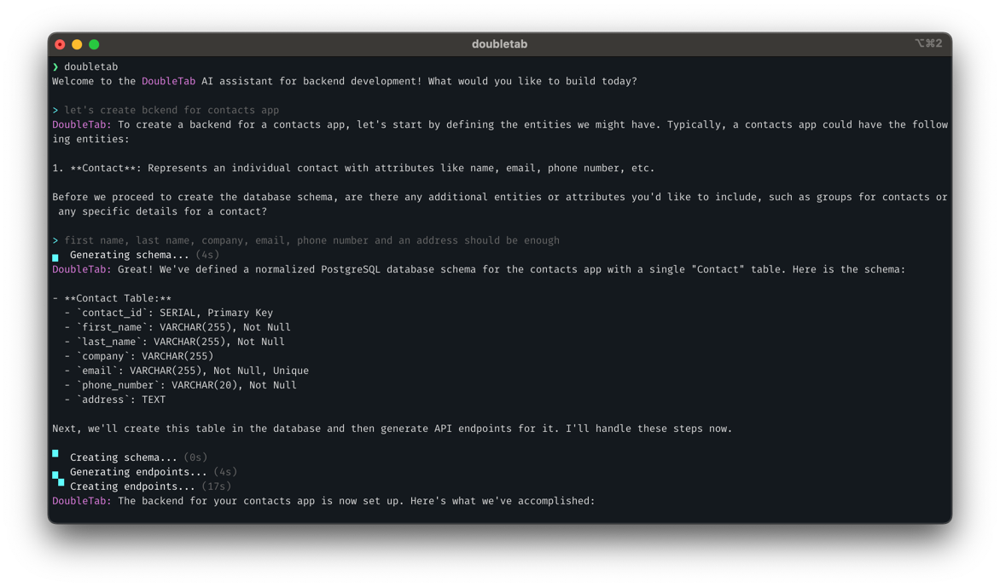

# DoubleTab

DoubleTab is an open-source AI-powered development tool that helps users create software projects from scratch to production. Designed for developers, but accessible to anyone, it automates essential backend tasks such as database schema generation, API endpoint creation, and code generation—streamlining the development workflow.



## Features

- [x] Schema Generation – Define your database schema with natural language input.
- [x] API Generation – Automatically generate structured API endpoints for your schema.

## Installation

To install DoubleTab, you need to have Go installed on your machine. If you don't have Go installed, you can download it from the [official website](https://golang.org/dl/).

Once you have Go installed, you can install DoubleTab by running the following command:

```bash
go install github.com/doubletabai/doubletab@latest
```

You should now be able to run the `doubletab` command from your terminal. Make sure to add the Go bin directory to your PATH if you haven't already.

```bash
export PATH=$PATH:$(go env GOPATH)/bin
```

## Usage

Change to an empty directory where you want to create your project and run the following command:

```bash
PG_HOST=<host> PG_PORT=<port> PG_DB=<db_name> PG_USER=<user> PG_PASS=<secret> PG_SSL=disable OPENAI_API_KEY=<secret> doubletab
```

Make sure that you have a PostgreSQL database running and the necessary environment variables set. The `OPENAI_API_KEY` environment variable is required to use the OpenAI API for natural language processing. DoubleTab will guide you through the process of creating your project from the database schema to the API endpoints. Just describe what kind of project/application you want to create, and DoubleTab will try to come up with right solutions.

## Roadmap

- [ ] Ollama Integration – Integrate Ollama for local LLMs.
- [ ] Different DBs/languages – Support for different databases and programming languages.
- [ ] Code Execution – Run and validate generated Go code securely.
- [ ] Standardized Codebase – Ensures consistency by following predefined coding patterns.
- [ ] Tests Generation – Automatically generate and run tests for the generated code.
- [ ] Extensible Tools – Supports custom tools for additional automation.
- [ ] Custom Knowledge Base – Create and apply custom knowledge bases for specific domains.
